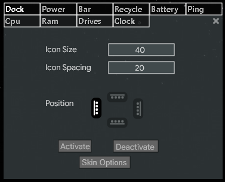

# Embla
Hello and welcome to this the Embla Rainmeter Skin :) 

The differents features are:

 - [Dock](#dock)
 - [PowerAction](#poweraction)
 - [Bar](#bar)
 - [Recycle Bin](#recycle-bin)
 - [Battery](#battery)
 - [Ping](#ping)
 - [Ram and Cpu](#ram-and-cpu)
 - [Drives](#drives)
 - [Clock](#clock)

For every features, you can acces to a option menu, to modify some specifics options, and enable/Disable the skin 

The volume and weather skin come from [Sonder](https://www.deviantart.com/michaelpurses/art/Sonder-Rainmeter-skin-838147223) 

## Dock
The dock feature, enable to create shortcuts to differents applications.  
The dock is hidden, 

### General options

You can acces to general options by right clicking on the dock, and click on `Dock Settings`  
  

You have acces to differents options:
- Change `Icon Size`
- Change `Icon Spacing` 
- Change `position` of the dock
- Activate or disable the skin

 
  

### Shortcuts Options
You have acces to 3 more options by clicking on `Skin Options`
- `Swap` two shortcuts
- `Delete` a shortcut 
- `Add` a shortcut 

A new window will open, with the differents choises.  
- If you want to swap the position of a shortcut, change his value (1,2,3,..)
- To delete a icon, click on the red cross 
- To add a icon, click on the green cross  

#### Add Shortcut
 
  

**You need to click on `Enter` to validate the input**
- In `Icon Image`, write the name of your image in the folder `Embla\@Resources\Dock\Icons` 
- in the `Icon Action`, add the action you want (`command line`, `http links`, or `URI to a exe`.) 

## PowerAction

The powerAction feature allow to use the differents power options of Windows
- `Lock` 
- `Log Off` 
- `Sleep`
- `Restart` 
- `Shutdown` 

There is two variants of the skin: 
- `Static`, where all the icons are shown 
- `Slider`, where only the shutdown icon is shown, and show the others by passing over  

When clicking on a icon, you will have a `yes/no` choise 

#### Options  
In the Power tab, you will have differents options: 
- Choose between the two `type`
- Modifiy the `spacing` between icons 
- Select black or white `theme`
- Select the `direction` of the icons 
- `Hide icons` you don't want 

## Bar 

The bar feature is a simple bar think to place other skins on. 

#### Options 

In the Bar tab, you will have differents options:
- Change the bar `color` 
- Change the bar `size`
- Change the bar `position` (horizontal/Vertical)

## Recycle bin

The recycle feature reproduce the classic Windows Recycle Bin.  

- You can have the informations of the space used by the Recycle Bin, the number of elements in it by passing over the bin.  
- By `Right clicking` on it, you can `clean the Recycle Bin` 
- By `Left clicking` on it, you can `open the Recycle Bin`

##### Options 

In the Recycle tab, you will have differents options: 
- Change the `color of the number elements `
- Change the `color of the space used` 
- Change the `size` of the Recycle Bin 

## Battery 

The battery feature allow you to have a look of the battery usage.   
- By `passing over` the battery, you can `see the pourcentage`.  
- With a `left click` on it, it will `open the Windows Battery settings` 

#### Options 

In the Battery bar, you will have differents otpions: 
- Change the bar `color` 
- Change the `theme` black\white 

## Ping 

The ping feature will just ping  a server  

The green dot will turn `red` if it exceed the `limit value`

#### Options 

In the Ping tab, you will have differents options:
- Change the `text color` 
- Change the `limit value` 
- Change the `destination` of the ping 

## Ram and Cpu 

The Ram and Cpu feature will allow you to see the charge of each of them.  
- You can also see the application who uses the cpu the most  
- When `clicking` on the Cpu or the Ram skin, that will open the `task manager`  

#### Options 

For the **CPU**, you can hide the `top`, or resize it   

For the **RAM**, you can only Activate/Deactivate  

## Drives 

The drives feature will show the usage of the drive, and the space left.  
- When clicking on a drive, it will open it 
- By default the drives are `C/D/E/F`, but you can easily change it in the `ini file`

#### Options 

In the Drives tab, you can enable/disable a drive 

## Clock 
The clock feature is a simple clock, that will take the system langage for the date. 
- By `clicking` on it, it will open the `Windows clock settings`

#### Options 

In the clock tab, you will have differents options:
- Change the `size of the time`
- Change the `size of the date` 
- Change the `color of the text` 

